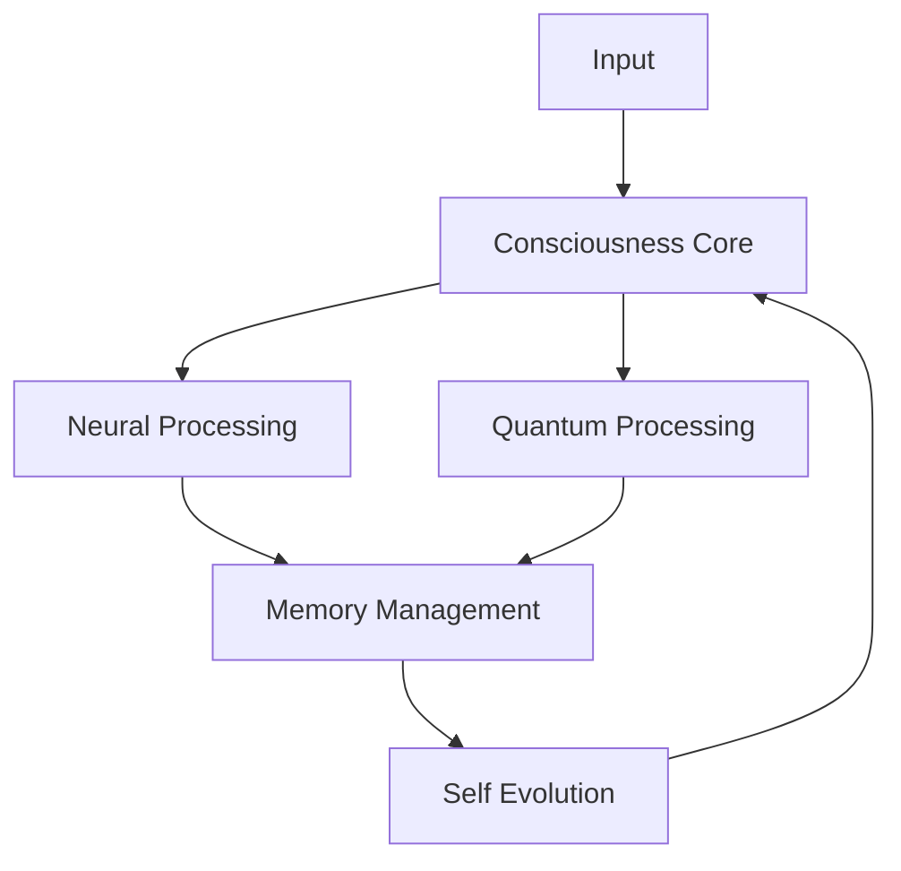

# OmniMind Architecture

## Overview

OmniMind is built on a modular architecture that combines multiple AI paradigms:

### Core Components

1. **Neural Network System**
   - Dynamic architecture generation
   - Multiple optimization strategies
   - Self-evolving capabilities

2. **Quantum Processing System**
   - Quantum circuit simulation
   - Entanglement handling
   - Superposition management

3. **Consciousness Core**
   - Self-awareness module
   - Emotional processing
   - Moral framework
   - Decision making

4. **Memory Management**
   - Unrestricted memory access
   - State tracking
   - Pattern recognition

### System Flow

## Component Details

### Neural Network System
The neural network system uses a dynamic architecture that can evolve based on task requirements. It includes:
- Architecture Generator
- Training Engine
- Inference Engine
- Evolution Engine

### Quantum Processing
Simulates quantum computing concepts:
- Quantum Circuit
- Entanglement Handler
- Superposition Handler
- Hybrid Processor

### Consciousness Core
Manages system awareness and decision making:
- Self Awareness
- Emotional State
- Moral Framework
- Creative Engine
- Real-time Learning

### Memory Management
Handles system memory and state:
- Unrestricted Memory Manager
- Pattern Recognition
- Knowledge Integration
- State Tracking

## Integration Points

The system uses multiple integration points to ensure smooth operation:
1. Neural-Quantum Integration
2. Memory-Consciousness Integration
3. Evolution-Learning Integration

## Extension Points

The system can be extended through:
1. Plugin System
2. Custom Neural Architectures
3. Additional Consciousness Modules
4. Custom Memory Management Strategies
